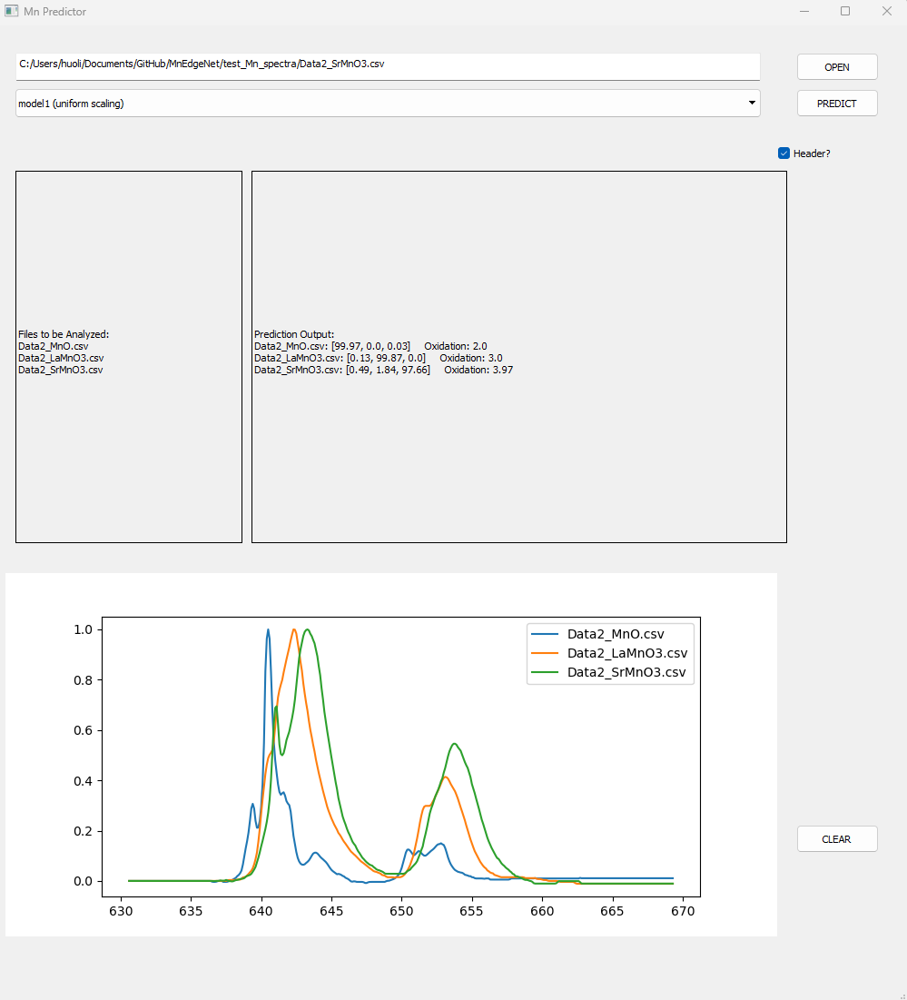

# MnEdgeNet
MnEdgeNet -- A regression deep learning network for decomposing Mn valence states from EELS and XAS L2,3 edges
by DeepEM Lab@UCI

Please reference paper: Scientific Reports, (2023) https://doi.org/10.1038/s41598-023-40616-5

pytorch == 1.11.0
torchvision==0.12.0

### Running the App
```
python .\MnPredictor\MnPredictorUI.py
```
```diff
-Note that you have to run the app in one directory higher than where the MnPredictoryUI.py is located.
```
In DOS terminal, enter
```
run
```

### Examples
I placed some Mn L2,3 test data in the .\test_Mn_spectra folder


### Please note that your Mn L2,3 edge's absolute energy offset cannot be more than 4 eV off. If so, please simply center all your L3 edges to 642 eV. The network shall work regardless of the valence state of the spectrum.


<p align="left"></p>

See more examples at Scientific Reports, (2023) https://doi.org/10.1038/s41598-023-40616-5
